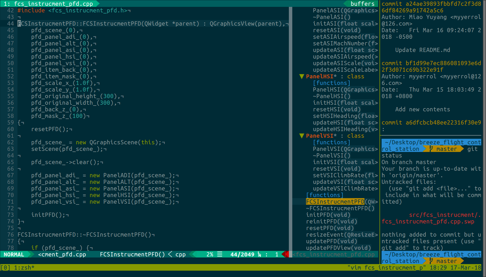

# linux-tool-configs



## Description

Install, uninstall or backup config files that are used commonly under Linux, such as powerline, terminal, xterm, tmux, vim, zsh, etc.

## Usage

### Installation

- Clone the repository to your Desktop:

  ```bash
  $> cd Desktop
  $> git clone https://github.com/myyerrol/linux-tool-configs.git
  ```

- Execute the following shell scrpit:

  ```bash
  $> cd linux_tool_configs
  $> ./setup.sh --i
  ```

- **Because the installation of ZSH will cause the current script to exit, you should copy the `.zshrc` file to `HOME` manually to solve this problem:**

  ```bash
  $> cp -ipv ./zsh/.zshrc ${HOME}
  ```

### Uninstall

- Execute the following shell scrpit:

  ```bash
  $> ./setup.sh -u
  ```

### Backup

- Execute the following shell scrpit:

  ```bash
  $> ./setup.sh -b
  ```

## Configuration

### Terminal

- Open the **Profile Preferences** in the current terminal.

- Choose the **Gerenal** option and choose the font with the name of **Powerline**.
